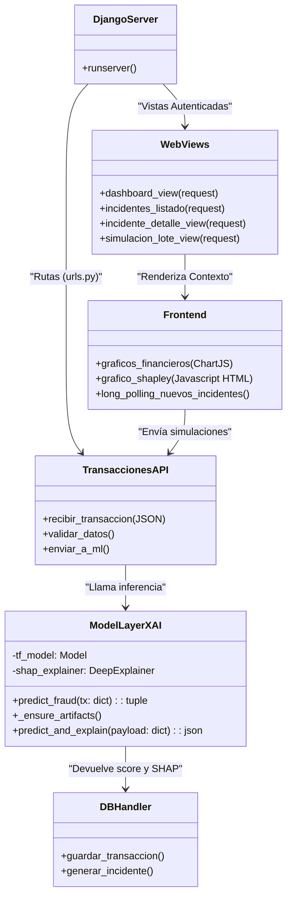

# Diagrama de Clases y Módulos (MyFraudLock)

Puede copiar e incrustar este código en sus documentos de tesis compatibles con Markdown o visores visuales (como Obsidian, GitHub o Mermaid Live Editor) para generar un gráfico UML:

